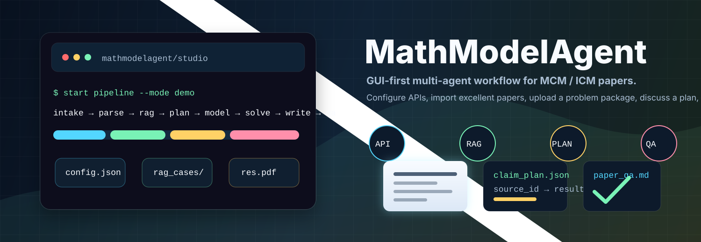
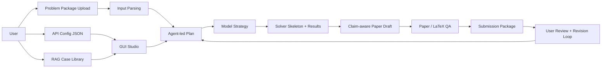

<p align="center">
  <a href="README.md"></a>
  <a href="README.zh-CN.md"></a>
</p>

<p align="center">
  
</p>

<div align="center">

# MathModelAgent

**A GUI-first multi-agent workspace for MCM / ICM mathematical modeling.**

Configure APIs, import exemplary papers, upload this year's problem package, discuss a plan with the agent, then generate a claim-aware paper with code, sources, QA reports, and exportable artifacts.

[Quick Start](#quick-start) · [How It Works](#how-it-works) · [GUI Guide](#gui-guide) · [Configuration](#configuration) · [RAG Library](#rag-knowledge-base) · [Roadmap](#roadmap)


</div>

---

## What This Project Does

MathModelAgent is designed around the real workflow of a mathematical modeling contest:

1. The user configures model, search, document parsing, academic, and data APIs.
2. The user imports excellent previous papers into a structured RAG knowledge base.
3. The user uploads the current problem, attachments, data files, templates, and extra requirements.
4. The agent parses the task package and drafts an implementation plan.
5. The user and agent discuss the plan before execution.
6. The pipeline researches, models, writes, checks, and packages the submission.
7. The user reviews generated artifacts and asks for revisions.

The current version is a mature product skeleton: it has a GUI, runtime configuration, structured uploads, RAG indexing, plan-driven pipeline stages, source registration, modeling strategy selection, claim-aware drafting, paper QA, artifact packaging, and benchmark smoke tests. Some provider adapters are still offline-safe facades and should be connected to real APIs for production contest use.

---

## Feature Overview

| Area | What is available now |
|---|---|
| GUI Studio | A `/studio` workspace for API settings, RAG, task uploads, planning, chat, progress, source registration, artifacts, and run control. |
| Runtime config | One ignored local JSON file for real API keys: `backend/mcm_agent_config.local.json`. The repository only commits `backend/mcm_agent_config.example.json`. |
| Provider tests | Each API row in the GUI has a test button. Responses mask secrets. |
| RAG library | User-filled case folders under `backend/data/rag_cases/`, with deterministic local vector indexing and retrieval logs. |
| Problem package | Upload problem PDFs, data, templates, images, archives, and extra requirements into a structured workspace manifest. |
| Input parsing | Generates `input/parsed/parsed_manifest.json`, `problem.md`, normalized table copies, asset metadata, and parse QA. |
| Pipeline | Runs `intake -> parse -> rag -> plan -> model -> solve -> write -> qa -> export`, with state and progress events. |
| Source registry | Registers web, academic, and official-data sources as stable `source_id` records for later citation and claim evidence. |
| Modeling MVP | Classifies problem type, ranks model candidates, writes model decisions, creates solver skeletons, and records results. |
| Claim-aware writing | Generates `paper/claim_plan.json` and a paper draft with claim markers across abstract, introduction, assumptions, model, results, limitations, and conclusion. |
| Paper QA | Checks required sections, claim markers, long lines, wide tables, long formulas, and TeX engine availability. |
| Export package | Builds a submission zip with papers, figures, code, logs, data tables, QA reports, and manifests. |
| Regression checks | Benchmark smoke suite verifies that the core artifacts are still produced by the pipeline. |

---

## Quick Start

### Option A: Docker Compose

Docker is the easiest way to launch the full stack.

```bash
git clone https://github.com/jsyzlbw/MathModelAgent.git
cd MathModelAgent
cp backend/mcm_agent_config.example.json backend/mcm_agent_config.local.json
docker compose up --build
```

Open:

- Frontend: [http://localhost:5173](http://localhost:5173)
- Studio workspace: [http://localhost:5173/studio](http://localhost:5173/studio)
- Backend API: [http://localhost:8000](http://localhost:8000)
- Backend docs: [http://localhost:8000/docs](http://localhost:8000/docs)

### Option B: Local Development

Run the backend:

```bash
cd backend
cp mcm_agent_config.example.json mcm_agent_config.local.json
uv sync
uv run uvicorn app.main:app --host 0.0.0.0 --port 8000 --ws-ping-interval 60 --ws-ping-timeout 120
```

Run the frontend in another terminal:

```bash
cd frontend
pnpm install
pnpm dev --host
```

Open [http://localhost:5173/studio](http://localhost:5173/studio).

---

## GUI Guide

### 1. Configure APIs

Open the Studio page and go to the API configuration panel. Fill in the providers you want to use, then click the test button beside each row.

Supported configuration groups:

- LLM roles: `coordinator`, `modeler`, `coder`, `writer`
- Search: Tavily, Brave Search, Exa, Firecrawl
- Academic: OpenAlex, Semantic Scholar
- Document parsing: MinerU REST or CLI
- Humanization: UShallPass-compatible endpoint
- Official data: World Bank, OECD, UNData, FRED, US Census, NOAA, NASA POWER, Open-Meteo, Overpass
- RAG: Voyage embedding and reranker settings

The GUI writes real secrets to:

```text
backend/mcm_agent_config.local.json
```

That file is ignored by git. Do not commit it.

### 2. Fill the RAG Knowledge Base

Prepare the case folders described in [RAG Knowledge Base](#rag-knowledge-base), then click **Vector Index** in Studio. The backend creates local chunk and vector files and writes retrieval logs.

### 3. Create a Workspace

In Studio, create a task workspace and upload the current problem package:

- Problem statement
- Provided data
- Figures or attachments
- Required format examples
- Extra constraints from the contest or your team
- Optional images for multimodal discussion

The backend records everything in:

```text
project/work_dir/<task_id>/input/input_manifest.json
```

### 4. Parse Inputs

Click **Parse Inputs**. The parser creates:

```text
project/work_dir/<task_id>/input/parsed/parsed_manifest.json
project/work_dir/<task_id>/input/parsed/problem.md
project/work_dir/<task_id>/input/parsed/tables/
project/work_dir/<task_id>/input/parsed/assets_manifest.json
project/work_dir/<task_id>/input/parsed/parse_qa.md
```

Text and table files are parsed directly. PDF, image, and Office files are registered as provider-ready assets for MinerU or future multimodal providers.

### 5. Discuss the Plan

Ask the agent to think through the problem before execution. The planning stage is intended to be agent-led:

- The agent studies the uploaded problem.
- It checks RAG cases and registered sources.
- It proposes a modeling and writing plan.
- The user can confirm, edit, regenerate, ask questions, skip, or abort.

Conversation and revision records are saved under:

```text
project/work_dir/<task_id>/conversation/messages.jsonl
project/work_dir/<task_id>/review/revision_requests.jsonl
project/work_dir/<task_id>/review/revision_summary.md
```

### 6. Run the Pipeline

Click **Start Run**. In demo mode, the current pipeline runs these stages:

```text
intake -> parse -> rag -> plan -> model -> solve -> write -> qa -> export
```

Progress is visible through:

```text
project/work_dir/<task_id>/pipeline/state.json
project/work_dir/<task_id>/progress_events.jsonl
project/work_dir/<task_id>/artifact_registry.json
```

This is the part that keeps the user from thinking the app froze: every stage records what it is doing and which artifacts it created.

### 7. Review and Export Artifacts

Important outputs include:

```text
project/work_dir/<task_id>/reports/model_candidates.json
project/work_dir/<task_id>/reports/model_decision.md
project/work_dir/<task_id>/results/results_registry.json
project/work_dir/<task_id>/paper/claim_plan.json
project/work_dir/<task_id>/res.md
project/work_dir/<task_id>/review/paper_qa_report.json
project/work_dir/<task_id>/review/paper_qa_report.md
project/work_dir/<task_id>/exports/submission_package.zip
```

The export package skips private inputs and chat logs by default, while keeping reviewable papers, figures, code, result tables, QA reports, logs, and manifests.

---

## RAG Knowledge Base

The RAG library is intentionally empty in git. Add one folder per excellent modeling case:

```text
backend/data/rag_cases/
  2024-mcm-c-ocean-plastic/
    problem.pdf
    paper.pdf
    data/
      observations.csv
    notes.md
```

Recommended structure:

| File or folder | Required | Purpose |
|---|---:|---|
| `problem.pdf`, `problem.md`, or `problem.txt` | Yes | Original contest problem. |
| `paper.pdf`, `paper.md`, or `paper.txt` | Yes | High-quality solution paper. |
| `data/` | No | Provided data or cleaned data. |
| `notes.md` | No | Modeling methods, tricks, scoring notes, or personal annotations. |

After adding cases, use the GUI **Vector Index** button or the RAG API to rebuild the index. The current indexer uses deterministic local embeddings for reliable offline tests; the runtime config already contains Voyage fields for the next real embedding adapter.

---

## How It Works



### Main backend services

| Service | Responsibility |
|---|---|
| `RuntimeConfigRegistry` | Reads JSON runtime configuration and provides provider-specific settings. |
| `InputManifestService` | Tracks uploaded files, categories, hashes, and previews. |
| `InputParsingService` | Converts the uploaded package into parsed problem artifacts. |
| `RagVectorIndexService` | Builds and queries local vector-like indexes for the RAG library. |
| `PipelineService` | Orchestrates the visible stage-by-stage workflow. |
| `SourceRegistryService` | Stores stable source records. |
| `SourceProviderService` | Provides offline-safe facades for search, academic, and official-data providers. |
| `ModelingStrategyService` | Detects problem types and ranks modeling candidates. |
| `SolverTemplateService` | Writes solver skeletons and result registries. |
| `ClaimPlanService` | Builds the paper evidence and claim chain. |
| `PaperDraftService` | Writes claim-aware paper drafts. |
| `PaperQAService` | Checks draft and formatting risks. |
| `BenchmarkSuiteService` | Runs smoke benchmarks for regression stability. |

---

## Configuration

Copy the example config:

```bash
cp backend/mcm_agent_config.example.json backend/mcm_agent_config.local.json
```

Then edit it directly or use the GUI.

Minimal LLM example:

```json
{
  "llm": {
    "coordinator": {
      "api_type": "openai-chat",
      "api_key": "YOUR_KEY",
      "base_url": "https://api.openai.com/v1",
      "model": "gpt-4.1",
      "context_window": 128000,
      "max_tokens": null
    }
  }
}
```

Recommended provider coverage for serious use:

| Need | Suggested provider |
|---|---|
| Main reasoning and writing | OpenAI-compatible chat model with long context |
| Search | Tavily, Exa, Brave Search, Firecrawl |
| Academic literature | OpenAlex and Semantic Scholar |
| Document extraction | MinerU |
| Embedding and rerank | Voyage `voyage-4-large` and `rerank-2.5` |
| Official data | FRED, US Census, NOAA, World Bank, Open-Meteo, Overpass |

Never commit `backend/mcm_agent_config.local.json`, `.env.dev`, contest files, uploaded papers, or generated work directories.

---

## API Reference Highlights

The GUI uses `/api/gui` routes. Useful endpoints:

| Endpoint | Purpose |
|---|---|
| `GET /api/gui/config` | Read masked config. |
| `PUT /api/gui/config` | Save local JSON config. |
| `POST /api/gui/config/test-provider` | Test one provider row. |
| `POST /api/gui/workspaces` | Create a workspace. |
| `POST /api/gui/workspaces/{task_id}/files` | Upload categorized files. |
| `GET /api/gui/workspaces/{task_id}/inputs` | List workspace inputs. |
| `POST /api/gui/workspaces/{task_id}/inputs/parse` | Parse uploaded inputs. |
| `POST /api/gui/workspaces/{task_id}/run` | Start demo or real workflow. |
| `GET /api/gui/workspaces/{task_id}/pipeline/status` | Read pipeline state. |
| `GET /api/gui/workspaces/{task_id}/events` | Read progress events. |
| `GET /api/gui/workspaces/{task_id}/artifacts` | List artifacts. |
| `POST /api/gui/workspaces/{task_id}/artifacts/package` | Build submission package. |
| `POST /api/gui/workspaces/{task_id}/sources/query` | Register external sources. |
| `POST /api/gui/rag/vector/rebuild` | Rebuild RAG vector index. |
| `POST /api/gui/rag/query` | Query RAG vector index. |

Open [http://localhost:8000/docs](http://localhost:8000/docs) after starting the backend for the full OpenAPI schema.

---

## Development

Backend tests:

```bash
cd backend
uv run pytest -q
```

Frontend build:

```bash
cd frontend
pnpm build
```

Recent verification:

```text
backend: 66 passed, 1 skipped
frontend: vue-tsc -b && vite build passed
```

---

## Project Layout

```text
MathModelAgent/
  backend/
    app/
      config/              # runtime JSON config and settings
      routers/             # FastAPI routers
      services/            # pipeline, RAG, parsing, sources, QA
      tests/               # regression and service tests
    data/rag_cases/        # user-filled excellent-paper knowledge base
    mcm_agent_config.example.json
  frontend/
    src/pages/studio/      # GUI-first workspace
    src/apis/              # frontend API clients
  docs/
    assets/                # README animation and documentation assets
    superpowers/plans/     # route-level implementation plans
```

---

## Roadmap

The project is ready for the next maturity phase:

- Connect real provider adapters for Voyage embeddings/rerank, Tavily, Exa, Brave, Firecrawl, OpenAlex, Semantic Scholar, FRED, US Census, NOAA, MinerU, and Overpass.
- Upgrade document extraction from metadata placeholders to real PDF/table/image parsing.
- Expand modeling agents for prediction, optimization, evaluation, simulation, graph, time-series, and statistical inference tasks.
- Add executable solver validation, figure generation, sensitivity analysis, and result consistency checks.
- Turn paper QA into automatic LaTeX/PDF repair for compile errors, formula overflow, table overflow, figure placement, and page limits.
- Add GUI controls for real/demo mode, benchmark runs, provider health dashboard, and revision replay.
- Build a public benchmark set of MCM/ICM tasks to measure parsing, planning, modeling, writing, and QA quality.

---

## Limitations

MathModelAgent is an active research prototype. It can already run a complete visible workflow, but it should not be treated as a guaranteed contest-winning system. Human review remains necessary, especially for model validity, data assumptions, numerical correctness, citations, and final paper quality.

The safest usage pattern is: let the agent do the heavy mechanical work, then let humans make the mathematical judgment calls.

---

## License

See the repository license file for details.
