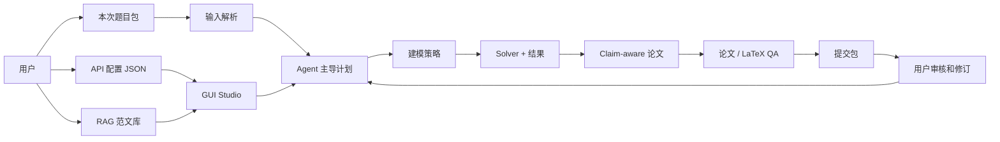

<p align="center">
  <a href="README.md"></a>
  <a href="README.zh-CN.md"></a>
</p>

<p align="center">
  
</p>

<div align="center">

# MathModelAgent

**面向 MCM / ICM 数学建模竞赛的 GUI-first 多 Agent 工作台。**

配置 API，导入优秀范文，上传本次赛题与附件，和 Agent 讨论计划，然后生成带 claim 论证链的论文、代码、来源登记、QA 报告与提交包。

[快速开始](#快速开始) · [工作流](#工作流) · [GUI 使用教程](#gui-使用教程) · [配置说明](#配置说明) · [RAG 知识库](#rag-知识库) · [未来路线](#未来路线)


</div>

---

## 这个项目做什么

MathModelAgent 按照真实数学建模比赛流程设计：

1. 用户配置模型、搜索、文档解析、论文网站、官方数据和 RAG API。
2. 用户把优秀数学建模范文导入结构化 RAG 知识库。
3. 用户上传本次赛题、附件、数据、格式样例和额外要求。
4. Agent 解析任务包，先生成实施计划。
5. 用户和 Agent 讨论计划，确认后再执行。
6. Pipeline 进行资料检索、建模、求解、论文写作、QA 和导出。
7. 用户审核结果，不满意可以继续提出修改意见。

当前版本已经不是单纯后端原型，而是一个比较完整的产品骨架：有 GUI、统一运行配置、结构化上传、RAG 索引、计划驱动 pipeline、source 登记、建模策略选择、claim-aware 写作、论文 QA、提交包导出和 benchmark smoke 测试。部分 provider 目前还是离线安全 facade，后续需要接入真实 API 才能达到正式比赛强度。

---

## 功能总览

| 模块 | 当前能力 |
|---|---|
| GUI Studio | `/studio` 工作台：API 设置、RAG、题目上传、计划、对话、进度、source 登记、产物和运行控制。 |
| 运行配置 | 真实 API 写入 `backend/mcm_agent_config.local.json`，该文件被 git 忽略；仓库只提交 `backend/mcm_agent_config.example.json`。 |
| API 通断测试 | GUI 中每个 provider 旁边都有测试按钮，后端返回脱敏结果。 |
| RAG 知识库 | 用户在 `backend/data/rag_cases/` 中按题目文件夹导入范文，支持本地确定性向量索引和检索日志。 |
| 本次题目包 | 支持上传赛题、数据、模板、图片、压缩包和额外要求，生成 workspace manifest。 |
| 输入解析 | 生成 `parsed_manifest.json`、`problem.md`、表格副本、资产清单和解析 QA。 |
| Pipeline | 阶段为 `intake -> parse -> rag -> plan -> model -> solve -> write -> qa -> export`，每步都有状态和事件。 |
| Source Registry | 把网页、论文和官方数据登记成稳定 `source_id`，供论文 claim 和证据链引用。 |
| 建模 MVP | 识别问题类型、排序模型候选、写模型决策、生成 solver skeleton 和结果 registry。 |
| Claim-aware 写作 | 生成 `paper/claim_plan.json`，论文各章节包含 claim 标记和证据链。 |
| 论文 QA | 检查章节、claim、长行、宽表、长公式和 TeX 环境。 |
| 提交包 | 生成包含论文、图表、代码、日志、结果表、QA 报告和 manifest 的 zip。 |
| 回归测试 | Benchmark smoke suite 检查 pipeline 核心 artifact 是否稳定生成。 |

---

## 快速开始

### 方案 A：Docker Compose

Docker 是最省事的完整启动方式。

```bash
git clone https://github.com/jsyzlbw/MathModelAgent.git
cd MathModelAgent
cp backend/mcm_agent_config.example.json backend/mcm_agent_config.local.json
docker compose up --build
```

打开：

- 前端：[http://localhost:5173](http://localhost:5173)
- Studio 工作台：[http://localhost:5173/studio](http://localhost:5173/studio)
- 后端 API：[http://localhost:8000](http://localhost:8000)
- 后端 API 文档：[http://localhost:8000/docs](http://localhost:8000/docs)

### 方案 B：本地开发

启动后端：

```bash
cd backend
cp mcm_agent_config.example.json mcm_agent_config.local.json
uv sync
uv run uvicorn app.main:app --host 0.0.0.0 --port 8000 --ws-ping-interval 60 --ws-ping-timeout 120
```

另开一个终端启动前端：

```bash
cd frontend
pnpm install
pnpm dev --host
```

打开 [http://localhost:5173/studio](http://localhost:5173/studio)。

---

## GUI 使用教程

### 1. 配置 API

进入 Studio 页面，在 API 配置面板填写你要使用的 provider，然后点击每行右侧的测试按钮。

配置组包括：

- LLM 角色：`coordinator`、`modeler`、`coder`、`writer`
- 搜索：Tavily、Brave Search、Exa、Firecrawl
- 论文与学术：OpenAlex、Semantic Scholar
- 文档解析：MinerU REST 或 CLI
- 降 AI 痕迹 / Humanization：UShallPass 兼容接口
- 官方数据：World Bank、OECD、UNData、FRED、US Census、NOAA、NASA POWER、Open-Meteo、Overpass
- RAG：Voyage embedding 和 reranker 设置

GUI 会把真实密钥写入：

```text
backend/mcm_agent_config.local.json
```

这个文件已经被 `.gitignore` 忽略，不要提交。

### 2. 填充 RAG 知识库

先按照 [RAG 知识库](#rag-知识库) 中的结构准备 case 文件夹，然后在 Studio 点击 **向量索引**。后端会生成 chunk、vector 和检索日志。

### 3. 创建工作区并上传本次题目

在 Studio 创建新任务，然后上传：

- 本次赛题 PDF / 文档
- 题目提供的数据
- 图片或附件
- 格式样例
- 比赛或团队额外要求
- 可选的多模态讨论图片

后端会记录到：

```text
project/work_dir/<task_id>/input/input_manifest.json
```

### 4. 解析输入

点击 **解析输入**。解析结果包括：

```text
project/work_dir/<task_id>/input/parsed/parsed_manifest.json
project/work_dir/<task_id>/input/parsed/problem.md
project/work_dir/<task_id>/input/parsed/tables/
project/work_dir/<task_id>/input/parsed/assets_manifest.json
project/work_dir/<task_id>/input/parsed/parse_qa.md
```

文本和表格会直接解析；PDF、图片和 Office 文件会先登记为 provider-ready asset，等待 MinerU 或后续多模态 provider 深度解析。

### 5. 和 Agent 讨论计划

不要一上来就让 Agent 写论文。推荐先让 Agent 思考：

- 研究题目和附件。
- 检索 RAG 范文和外部来源。
- 给出建模与写作实施计划。
- 用户可以确认、修改、重生成、提问、跳过或中止。

对话和修订记录会保存在：

```text
project/work_dir/<task_id>/conversation/messages.jsonl
project/work_dir/<task_id>/review/revision_requests.jsonl
project/work_dir/<task_id>/review/revision_summary.md
```

### 6. 开始运行 Pipeline

点击 **开始运行**。当前 demo pipeline 阶段为：

```text
intake -> parse -> rag -> plan -> model -> solve -> write -> qa -> export
```

用户可以通过这些文件看到 Agent 当前进度：

```text
project/work_dir/<task_id>/pipeline/state.json
project/work_dir/<task_id>/progress_events.jsonl
project/work_dir/<task_id>/artifact_registry.json
```

这也是 GUI 体验的关键：用户不会只看到“正在运行”，而是能知道 Agent 当前处于哪个阶段、生成了哪些文件。

### 7. 审核和导出

重要产物包括：

```text
project/work_dir/<task_id>/reports/model_candidates.json
project/work_dir/<task_id>/reports/model_decision.md
project/work_dir/<task_id>/results/results_registry.json
project/work_dir/<task_id>/paper/claim_plan.json
project/work_dir/<task_id>/res.md
project/work_dir/<task_id>/review/paper_qa_report.json
project/work_dir/<task_id>/review/paper_qa_report.md
project/work_dir/<task_id>/exports/submission_package.zip
```

提交包默认跳过私有输入和聊天日志，只保留可审查或可提交的论文、图表、代码、结果表、QA 报告、日志和 manifest。

---

## RAG 知识库

仓库中的 RAG 目录默认不包含用户论文。你需要按“一个题目一个文件夹”的方式放入优秀范文：

```text
backend/data/rag_cases/
  2024-mcm-c-ocean-plastic/
    problem.pdf
    paper.pdf
    data/
      observations.csv
    notes.md
```

推荐结构：

| 文件或文件夹 | 是否必需 | 作用 |
|---|---:|---|
| `problem.pdf`、`problem.md` 或 `problem.txt` | 是 | 原始赛题。 |
| `paper.pdf`、`paper.md` 或 `paper.txt` | 是 | 高质量解题论文。 |
| `data/` | 否 | 题目数据或整理后的数据。 |
| `notes.md` | 否 | 建模方法、评分经验、个人笔记。 |

放好后，在 GUI 中点击 **向量索引**，或调用 RAG API 重建索引。当前索引使用本地确定性 embedding fallback，保证离线测试稳定；配置文件已经预留 Voyage embedding/rerank 字段，后续可接真实向量模型。

---

## 工作流



### 主要后端服务

| 服务 | 职责 |
|---|---|
| `RuntimeConfigRegistry` | 读取 JSON 运行配置，为各 provider 提供配置。 |
| `InputManifestService` | 记录上传文件、分类、哈希和预览。 |
| `InputParsingService` | 把上传任务包解析成结构化题目产物。 |
| `RagVectorIndexService` | 构建和查询本地 RAG 向量索引。 |
| `PipelineService` | 编排可见的阶段式工作流。 |
| `SourceRegistryService` | 保存稳定 source 记录。 |
| `SourceProviderService` | 为搜索、论文、官方数据提供离线安全 facade。 |
| `ModelingStrategyService` | 识别题型并排序模型候选。 |
| `SolverTemplateService` | 生成 solver skeleton 和结果登记。 |
| `ClaimPlanService` | 构建论文 claim 与证据链。 |
| `PaperDraftService` | 生成 claim-aware 论文初稿。 |
| `PaperQAService` | 检查论文和排版风险。 |
| `BenchmarkSuiteService` | 运行 smoke benchmark，保障回归稳定。 |

---

## 配置说明

复制 example 配置：

```bash
cp backend/mcm_agent_config.example.json backend/mcm_agent_config.local.json
```

然后可以直接编辑 JSON，也可以在 GUI 中填写。

最小 LLM 示例：

```json
{
  "llm": {
    "coordinator": {
      "api_type": "openai-chat",
      "api_key": "YOUR_KEY",
      "base_url": "https://api.openai.com/v1",
      "model": "gpt-4.1",
      "context_window": 128000,
      "max_tokens": null
    }
  }
}
```

正式使用时建议覆盖：

| 需求 | 推荐 provider |
|---|---|
| 主推理和写作 | 长上下文 OpenAI-compatible Chat 模型 |
| 搜索 | Tavily、Exa、Brave Search、Firecrawl |
| 学术论文 | OpenAlex、Semantic Scholar |
| 文档解析 | MinerU |
| Embedding / Rerank | Voyage `voyage-4-large` 和 `rerank-2.5` |
| 官方数据 | FRED、US Census、NOAA、World Bank、Open-Meteo、Overpass |

不要提交 `backend/mcm_agent_config.local.json`、`.env.dev`、赛题文件、用户论文或生成的工作区目录。

---

## API 摘要

GUI 主要使用 `/api/gui` 路由：

| Endpoint | 作用 |
|---|---|
| `GET /api/gui/config` | 读取脱敏配置。 |
| `PUT /api/gui/config` | 保存本地 JSON 配置。 |
| `POST /api/gui/config/test-provider` | 测试单个 provider。 |
| `POST /api/gui/workspaces` | 创建工作区。 |
| `POST /api/gui/workspaces/{task_id}/files` | 上传分类文件。 |
| `GET /api/gui/workspaces/{task_id}/inputs` | 查看工作区输入。 |
| `POST /api/gui/workspaces/{task_id}/inputs/parse` | 解析上传输入。 |
| `POST /api/gui/workspaces/{task_id}/run` | 启动 demo 或 real workflow。 |
| `GET /api/gui/workspaces/{task_id}/pipeline/status` | 读取 pipeline 状态。 |
| `GET /api/gui/workspaces/{task_id}/events` | 读取进度事件。 |
| `GET /api/gui/workspaces/{task_id}/artifacts` | 列出产物。 |
| `POST /api/gui/workspaces/{task_id}/artifacts/package` | 生成提交包。 |
| `POST /api/gui/workspaces/{task_id}/sources/query` | 登记外部 source。 |
| `POST /api/gui/rag/vector/rebuild` | 重建 RAG 向量索引。 |
| `POST /api/gui/rag/query` | 查询 RAG 向量索引。 |

启动后端后可打开 [http://localhost:8000/docs](http://localhost:8000/docs) 查看完整 OpenAPI 文档。

---

## 开发与验证

后端测试：

```bash
cd backend
uv run pytest -q
```

前端构建：

```bash
cd frontend
pnpm build
```

最近一次验证结果：

```text
backend: 66 passed, 1 skipped
frontend: vue-tsc -b && vite build passed
```

---

## 项目结构

```text
MathModelAgent/
  backend/
    app/
      config/              # 运行配置和设置
      routers/             # FastAPI 路由
      services/            # pipeline、RAG、解析、source、QA
      tests/               # 回归测试和服务测试
    data/rag_cases/        # 用户填充的优秀范文知识库
    mcm_agent_config.example.json
  frontend/
    src/pages/studio/      # GUI-first 工作台
    src/apis/              # 前端 API 客户端
  docs/
    assets/                # README 动画和文档资源
    superpowers/plans/     # 路线级实现计划
```

---

## 未来路线

下一阶段重点是从“稳定骨架”进入“真实能力替换”：

- 接入真实 provider：Voyage embedding/rerank、Tavily、Exa、Brave、Firecrawl、OpenAlex、Semantic Scholar、FRED、US Census、NOAA、MinerU、Overpass。
- 把文档解析从元数据占位升级为真实 PDF、表格、图片和 Office 解析。
- 增强建模 Agent，覆盖预测、优化、评价、仿真、图论、时间序列、统计推断等题型。
- 增加 solver 执行验证、图表生成、敏感性分析和结果一致性检查。
- 将论文 QA 升级为自动 LaTeX/PDF 修复：编译错误、公式溢出、表格溢出、图片位置、页数限制。
- 在 GUI 中加入 real/demo 模式切换、benchmark 一键运行、provider 健康面板和 revision replay。
- 建立公开 MCM/ICM benchmark 题库，评测解析、规划、建模、写作和 QA 质量。

---

## 当前限制

MathModelAgent 仍然是活跃研究原型。它已经能跑通完整可见工作流，但还不能保证自动产出获奖论文。尤其是模型合理性、数据假设、数值正确性、引用质量和最终论文判断，仍需要人工审核。

最稳妥的用法是：让 Agent 承担繁重的机械工作，让人来做关键数学判断。

---

## License

请查看仓库中的 license 文件。
